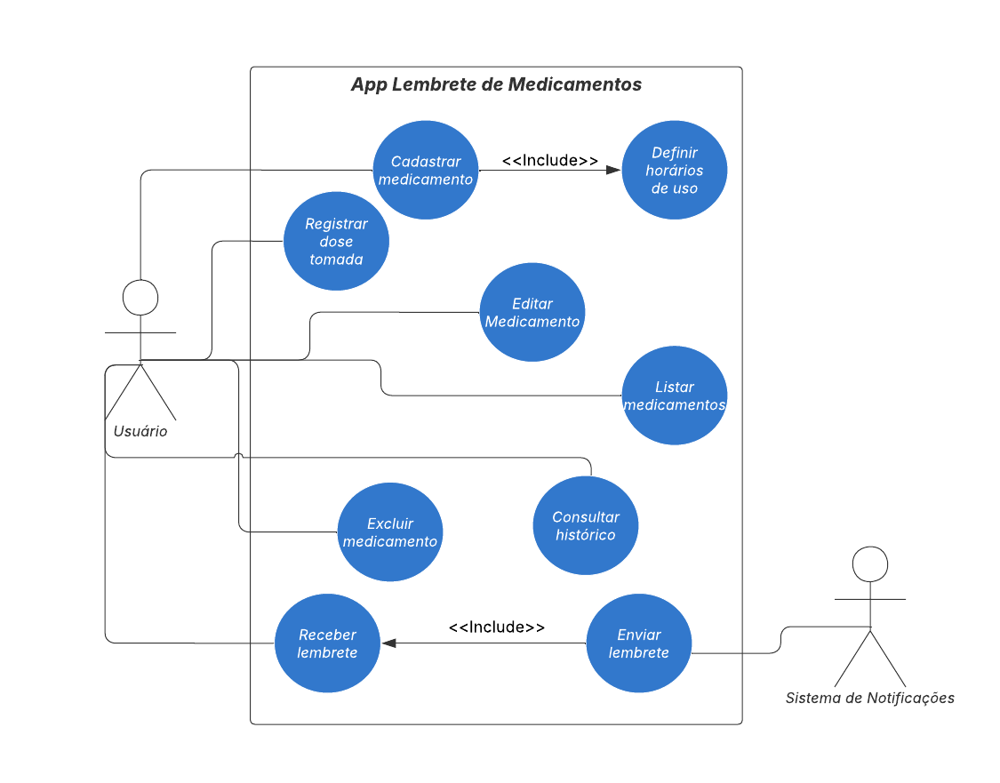

# App Lembrete de Medicamentos

## Objetivo
Desenvolver um aplicativo para dispositivos móveis que auxilie usuários a lembrar de tomar seus medicamentos nos horários corretos, contribuindo para a **ODS 3 – Saúde e Bem-Estar**.  
O sistema busca melhorar a adesão a tratamentos e, consequentemente, a qualidade de vida dos usuários.

## Problema
Muitas pessoas esquecem de tomar seus medicamentos no horário prescrito, o que pode comprometer a eficácia do tratamento e gerar riscos à saúde.  
Um aplicativo com lembretes automáticos pode ajudar a resolver esse problema.

## Tipo de Solução
Aplicativo para celular (Android/iOS) com:
- Cadastro de medicamentos
- Definição de horários
- Notificações de lembrete
- Registro de doses tomadas
  
## Requisitos
[Requisitos funcionais e não funcionais](docs/requisitos.md)
  
## Planejamento do Projeto
[Planejamento do Projeto](https://github.com/users/IsabelaDeOliveiraMiranda/projects/4)

## Diagrama de Caso de Uso

