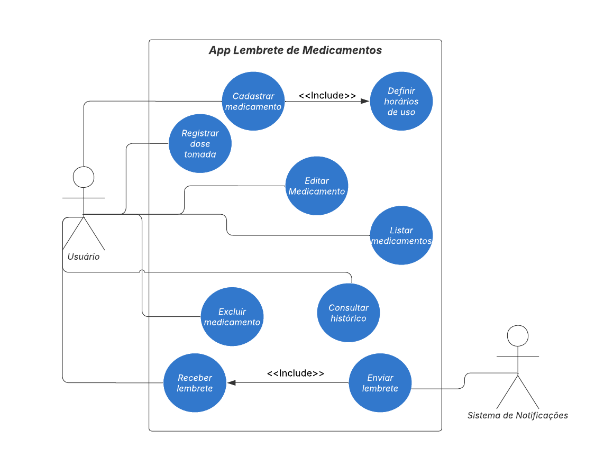

# App Lembrete de Medicamentos

## Objetivo
Desenvolver um aplicativo para dispositivos móveis que auxilie usuários a lembrar de tomar seus medicamentos nos horários corretos, contribuindo para o **ODS 3 – Saúde e Bem-Estar**.  
O sistema busca melhorar a adesão a tratamentos e, consequentemente, a qualidade de vida dos usuários.

## Problema
Muitas pessoas esquecem de tomar seus medicamentos no horário prescrito, o que pode comprometer a eficácia do tratamento e gerar riscos à saúde.  
Um aplicativo com lembretes automáticos pode ajudar a resolver esse problema.

## Tipo de Solução
Aplicativo para celular (Android/iOS) com:
- Cadastro de medicamentos
- Definição de horários
- Notificações de lembrete
- Registro de doses tomadas
- 
## Requisitos
### Funcionais:
- **RF01**: Cadastrar medicamento (nome, dose, horário)
- **RF02**: Listar medicamentos cadastrados
- **RF03**: Editar ou excluir medicamento
- **RF04**: Enviar lembrete no horário definido
- **RF05**: Registrar dose como tomada

### Não Funcionais:
- **RNF01**: Funcionar offline
- **RNF02**: Responder rápido (menos de 2 segundos)
- **RNF03**: Interface simples e intuitiva
- **RNF04**: Armazenar dados de forma segura

## 5. Diagrama de Caso de Uso

